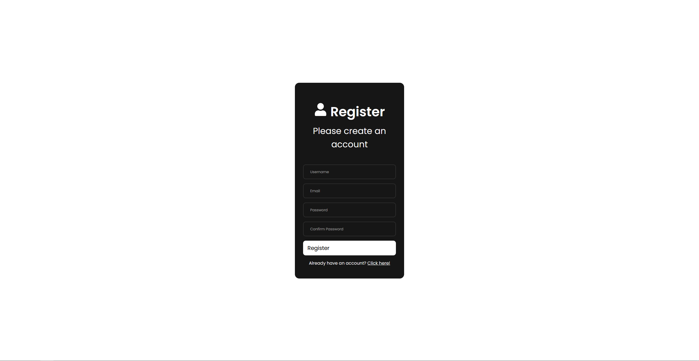
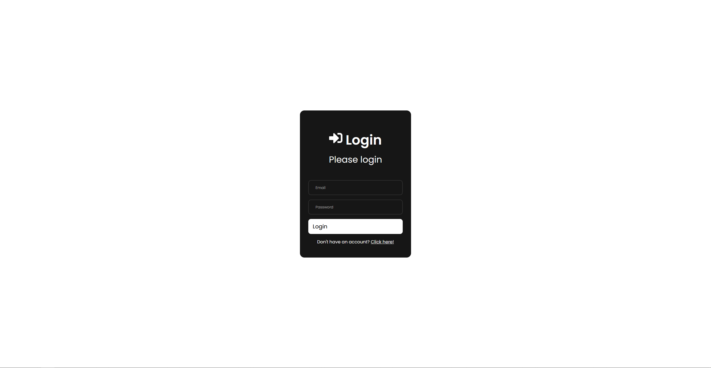
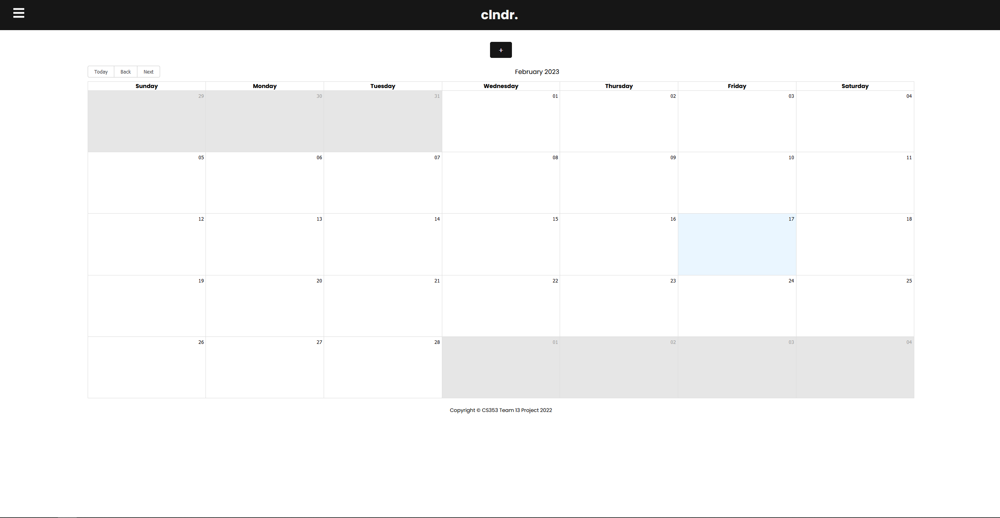
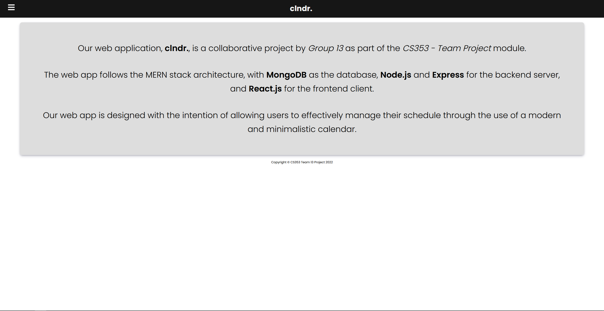
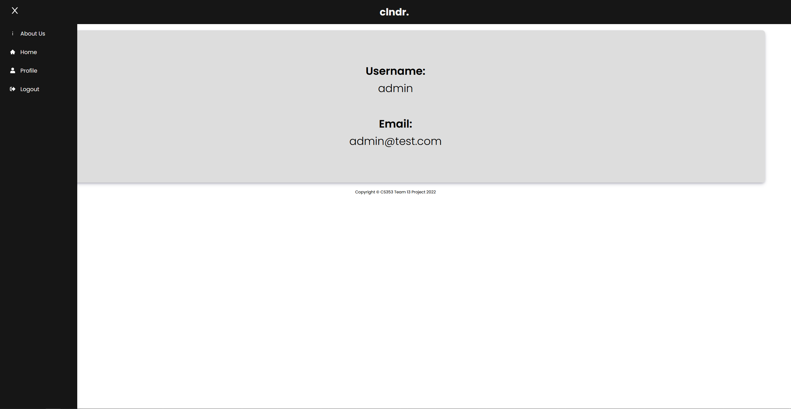
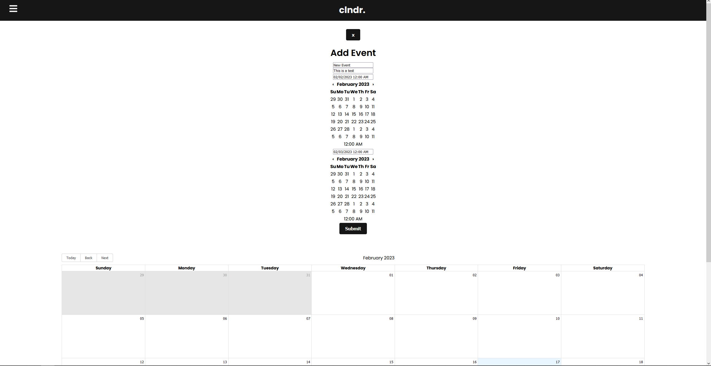
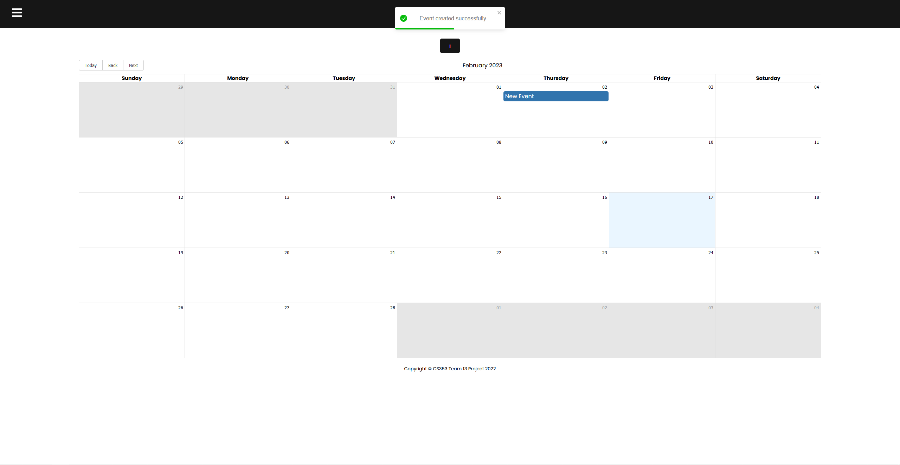

# clndr.
- This project is a calendar application that allows users to create, edit, and delete events. Users can also view events for a specific day, week, or month.
- This project was created as part of the CS353 Team Project module at <a href="https://www.maynoothuniversity.ie/">Maynooth University</a> in my first semester of my third year.
- The team consisted of 6 members (including me). I worked on all of the backend and migrating the frontend (HTML/CSS) to React.js.
<br>
<br>

# Technologies

This project is a RESTful API built using the MERN stack.
- **Backend:** MongoDB, Express, Node.js
- **Frontend:** React.js
<br>
<br>

# Start

### Backend

- ```cd backend``` to navigate to the backend folder.

- ```npm install``` to install all dependencies in the backend folder.

- ```.gitignore``` file layout:    
    ```
    NODE_ENV = <production or development (only matters for the 'errorMiddleware.js' file)>
    PORT = <any port you want. I chose 9000>
    DB_URI = <your MongoDB URI>
    JWT_SECRET = <create your own JWT secret>
    ```

- ```npm start``` to start the backend server (in the backend folder).

### Frontend

- ```cd frontend``` to navigate to the frontend folder.

- ```npm install``` to install all dependencies in the frontend folder.

- ```.gitignore``` file is the default one generated by create-react-app.

- ```npm start``` to start the frontend server (in the frontend folder).
<br>
<br>

# Screenshots

## Registration and Login Page


<br><br>

## Dashboard

<br><br>

## About Us

<br><br>

## Profile

<br><br>

## Adding an event

<br><br>


## Event created

<br><br>